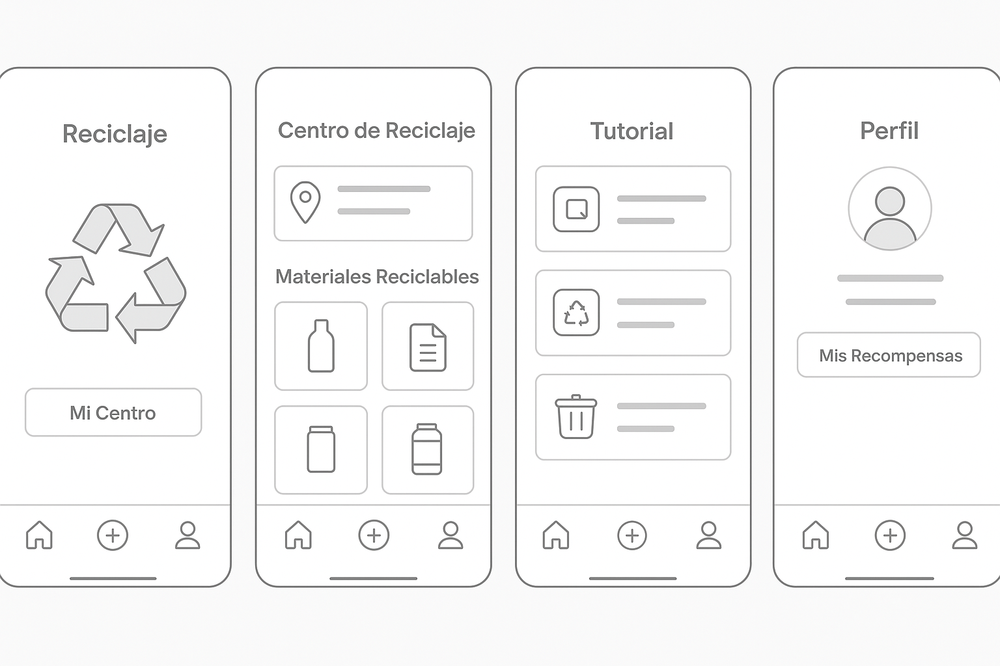
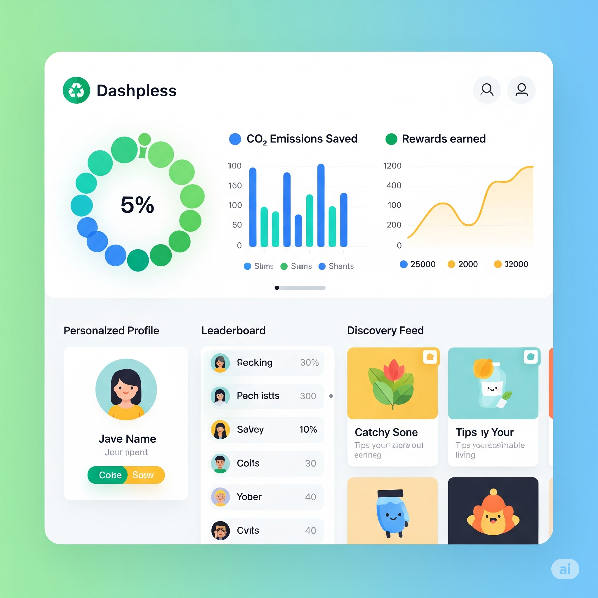
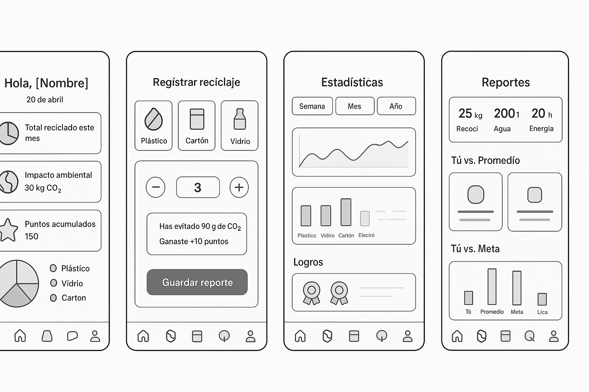
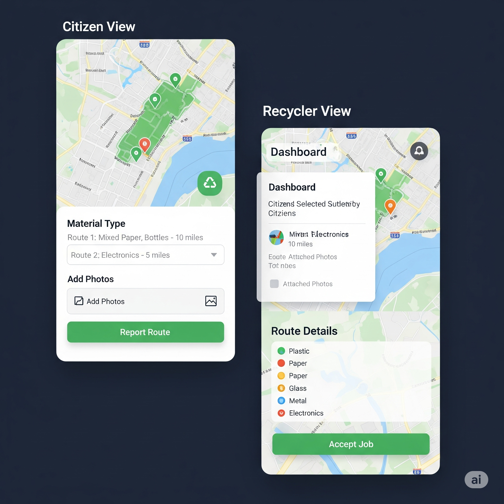

# Prompts para Wireframes

## Prompt 1
Diseña prototipos de baja a media fidelidad para una aplicación móvil sobre reciclaje.  
- Estilo limpio, minimalista, con iconos sencillos.  
- Prioriza la estructura y jerarquía de información.  
- No enfocarse en colores o imágenes realistas.  

**Resultados generados:**

## Prompt 2
Diseña prototipos para una aplicación móvil de reciclaje con un enfoque informativo y a datos.  
- Pantallas con estadísticas, reportes y gráficos de impacto ambiental.  
- Mostrar resultados de reciclaje y recompensas obtenidas.  
- Organización clara de métricas, tarjetas y secciones de comparación.  

